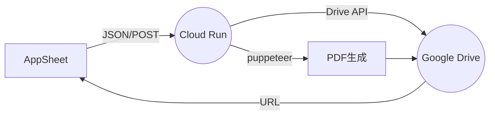

# システム概要

## 目的
動的なHTMLからPDFを生成し、Google Driveにアップロードするシステム

## 主要コンポーネント
1. HTML生成エンジン
   - テンプレートベースの動的HTML生成
   - カレンダーオーバーレイの適用

2. PDF変換エンジン
   - Puppeteerを使用したHTML→PDF変換
   - 高品質なPDF出力の保証

3. Google Drive連携
   - Workload Identityによる認証
   - ファイルアップロード管理

4. AppSheet連携
   - APIエンドポイント提供
   - 双方向データ連携

## システムフロー

## 技術スタック
- Node.js / TypeScript
- Express.js
- Puppeteer
- Google Cloud Platform
  - Cloud Run
  - Workload Identity
  - Google Drive API
