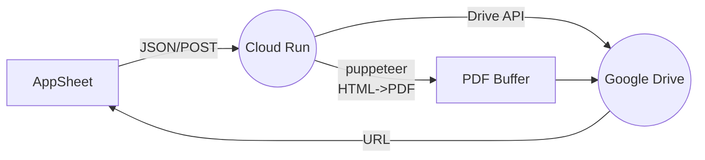

# 動的オーバーレイ付き HTML → PDF 生成設計書

以下のドキュメントでは、**Workload Identity** を使用した認証構成や **AppSheet** との連携を含め、
抜け漏れのない形で **HTML → PDF 変換 + Google Drive アップロード** の全体フローをまとめます。

## 目次
1. [システム概要](#システム概要)
2. [全体アーキテクチャ](#全体アーキテクチャ)
3. [機能要件とフロー](#機能要件とフロー)
4. [詳細設計](#詳細設計)
5. [AppSheet 側の設定](#AppSheet-側の設定)
6. [Workload Identity 構成](#Workload-Identity-構成)
7. [エラーハンドリング](#エラーハンドリング)
8. [セキュリティ対策](#セキュリティ対策)
9. [テスト計画](#テスト計画)
10. [まとめ](#まとめ)

---

## システム概要

- **目的：**
  1. 雛形 HTML に利用者情報や日付を反映しながら **動的にカレンダー部分を生成**。
  2. **特定の日付** に対して、HTML/CSS で **円・三角形・×印など** のオーバーレイを適用。
  3. その完成した HTML を puppeteer で PDF 化。
  4. PDF を **Google Drive** にアップロード。
  5. アップロード先の **Drive URL** を **AppSheet** に返却。

- **認証：**
  - Cloud Run → Google Drive 間の認証は **Workload Identity** を使用。
  - AppSheet からのリクエストにも特別なキーは不要（ただし GCP 側の設定により認可）。


## 全体アーキテクチャ



1. **AppSheet** が Cloud Run のエンドポイントに JSON を POST。
2. **Cloud Run** が HTML テンプレート + オーバーレイ設定 + puppeteer による PDF 生成。
3. 生成した PDF バッファを **Google Drive** にアップロード。
4. **アップロード完了** 後、生成された PDF の Drive リンクを **AppSheet** に返す。

---

## 機能要件とフロー

1. **カレンダー自動生成**
   - パラメーターに含まれる年・月から日数を計算し、日付 `<span>` を動的作成。
   - `overlay` に指定された日付にはオーバーレイクラス（例: `.circle`, `.triangle`）を付与。

2. **HTML → PDF**
   - puppeteer で headless Chrome を起動し、最終的な HTML をレンダリング。
   - `page.pdf()` で A4 等の形式で PDF を生成。

3. **Google Drive アップロード**
   - Workload Identity ベースで Google Drive API を使用。
   - `drive.files.create()` でフォルダに格納し、ファイル ID を取得。
   - ファイル ID から閲覧用リンクを生成して返却。

4. **AppSheet 連携**
   - AppSheet の「Call a webhook」アクションや Bot を利用。
   - 生成された PDF リンクをテーブルの任意のカラムに格納・表示。

---

## 詳細設計

### 1. 雛形 HTML (例)

```html
<!DOCTYPE html>
<html lang="ja">
<head>
    <meta charset="UTF-8">
    <title>訪問看護報告書</title>
    <style>
        /* カレンダー・オーバーレイ用クラス */
        .day {
            position: relative;
            width: 24px;
            height: 24px;
            display: inline-block;
            text-align: center;
        }
        .circle::before {
            content: "\25CB"; /* ○ */
            position: absolute;
            top: 50%;
            left: 50%;
            transform: translate(-50%, -50%);
            font-size: 14pt;
        }
        .triangle::before {
            content: "\25B3"; /* △ */
            position: absolute;
            top: 50%;
            left: 50%;
            transform: translate(-50%, -50%);
            font-size: 14pt;
        }
        /* 他にも diamond や cross など定義可能 */
    </style>
</head>
<body>
    <h1>訪問看護報告書</h1>
    <div id="calendar">
        <!-- 動的に挿入される日付セル -->
    </div>
</body>
</html>
```

### 2. 動的カレンダー生成

- サーバーサイド（Node.js） or クライアントサイド（puppeteer 内 JavaScript）で以下を行う：

```js
function generateCalendarHTML(year, month, overlay) {
  const daysInMonth = new Date(year, month, 0).getDate();
  let html = '';
  for (let d = 1; d <= daysInMonth; d++) {
    // overlay の判定
    let classes = 'day';
    overlay.forEach(item => {
      if (item.days.includes(d)) {
        classes += ` ${item.type}`; // circle, triangle等
      }
    });
    html += `<span data-day="${d}" class="${classes}">${d}</span>`;
  }
  return html;
}
```

- 生成後、`<div id="calendar">...</div>` に挿入。

### 3. Cloud Run (Node.js) 例

```js
// server.js
const express = require('express');
const puppeteer = require('puppeteer');
const { google } = require('googleapis');
const fs = require('fs');

const app = express();
app.use(express.json());

// Google Drive にアップロードする関数
async function uploadToDrive(pdfBuffer, folderId) {
  // Workload Identity 連携の場合
  const auth = new google.auth.GoogleAuth({
    scopes: ['https://www.googleapis.com/auth/drive.file'],
  });
  const drive = google.drive({ version: 'v3', auth });

  const fileMetadata = {
    name: `report-${Date.now()}.pdf`,
    parents: [folderId],
  };
  const media = {
    mimeType: 'application/pdf',
    body: Buffer.from(pdfBuffer),
  };

  const file = await drive.files.create({
    resource: fileMetadata,
    media,
    fields: 'id',
  });
  return `https://drive.google.com/file/d/${file.data.id}/view`;
}

function generateCalendarHTML(year, month, overlay) {
  const daysInMonth = new Date(year, month, 0).getDate();
  let html = '';
  for (let d = 1; d <= daysInMonth; d++) {
    let classes = 'day';
    overlay.forEach(item => {
      if (item.days.includes(d)) {
        classes += ` ${item.type}`;
      }
    });
    html += `<span data-day="${d}" class="${classes}">${d}</span>`;
  }
  return html;
}

app.post('/generate-pdf', async (req, res) => {
  try {
    const { year, month, overlay, output_folder_id } = req.body;
    if (!year || !month || !Array.isArray(overlay) || !output_folder_id) {
      throw new Error('Invalid or missing parameters');
    }

    // 雛形HTMLを読み込み
    let template = fs.readFileSync('template.html', 'utf8');

    // カレンダーHTML生成
    const calendarHTML = generateCalendarHTML(year, month, overlay);

    // <div id="calendar"></div> に挿入
    template = template.replace('<div id="calendar">', `<div id="calendar">${calendarHTML}`);

    // puppeteer で PDF 化
    const browser = await puppeteer.launch({ args: ['--no-sandbox'] });
    const page = await browser.newPage();
    await page.setContent(template, { waitUntil: 'networkidle0' });
    const pdfBuffer = await page.pdf({ format: 'A4' });
    await browser.close();

    // Drive アップロード
    const pdfUrl = await uploadToDrive(pdfBuffer, output_folder_id);
    res.json({ status: 'success', pdf_url: pdfUrl });
  } catch (error) {
    console.error(error);
    res.status(500).json({ status: 'error', message: error.message });
  }
});

const PORT = process.env.PORT || 8080;
app.listen(PORT, () => {
  console.log(`Server is running on port ${PORT}`);
});
```

---

## AppSheet 側の設定

1. **アクション (Webhook)**
   - **HTTP Verb:** `POST`
   - **URL:** `https://[YOUR_CLOUD_RUN_URL]/generate-pdf`
   - **Headers:**
     - `Content-Type: application/json`
   - **JSON Body** (例):

     ```json
     {
       "year": 2025,
       "month": 10,
       "overlay": [
         { "type": "circle", "days": [2, 10] },
         { "type": "triangle", "days": [5, 14] }
       ],
       "output_folder_id": "GOOGLE_DRIVE_FOLDER_ID"
     }
     ```
2. **Bot や Workflow:**
   - 任意のタイミングで上記アクションを呼び出す。
   - レスポンス内の `pdf_url` をテーブルに格納し、ユーザーに表示。

---

## Workload Identity 構成

**Workload Identity** を使用すると、サービスアカウントの鍵ファイルを管理せずに、
GCP リソース間で安全に認証できます。

1. **Cloud Run サービス アカウント:**
   - `roles/iam.workloadIdentityUser`, `roles/drive.file` を付与。
2. **Workload Identity プールとプロバイダ 作成:**
   - AppSheet が動作する Google アカウントやスプレッドシートをプールのメンバーとして登録。
3. **Cloud Run サービス** に対し、上記サービスアカウントを関連付け。
4. **AppSheet からの呼び出し** は、Workload Identity により自動的に認証。

> **Note:** AppSheet 側で別途 OAuth 2.0 設定や API キーを使わなくても、
> **クラウド間の連携** で認証できるのが利点。

---

## エラーハンドリング

- **パラメーター不備:**
  - `if (!year || !month || !overlay || !output_folder_id) throw new Error('Missing params')`;
  - `res.status(400).json({ status: 'error', message: '...' })` など。
- **puppeteer 起動失敗:**
  - try...catch でエラーをキャッチ、stack trace ログ出力。
- **Google Drive へのアップロード失敗:**
  - `throw new Error('Failed to upload PDF to Google Drive');`
- **AppSheet 側へのレスポンス:**
  - 失敗時は HTTP ステータス 500 とエラーメッセージを JSON で返却し、
    AppSheet でハンドリング可能にする。

---

## セキュリティ対策

1. **Workload Identity:**
   - サービスアカウント キー不要で管理が容易。
   - キー漏洩リスクを回避できる。
2. **入力検証:**
   - `typeof year === 'number'` か確認、`overlay` が配列か確認など。
3. **Cloud Run の IAM 設定:**
   - 公開するか、VPC Internal のみにするか要検討。
   - AppSheet からのみ呼べるようにする場合、[Cloud Run への IAM ポリシー](https://cloud.google.com/run/docs/configuring/authenticating) を調整。
4. **HTTPS 必須:**
   - Cloud Run のエンドポイントは自動 HTTPS 化されるが、必ず `https://` で呼び出すこと。

---

## テスト計画

1. **単体テスト:**
   - `generateCalendarHTML()`、`uploadToDrive()` など、各関数を別々にテスト。
2. **結合テスト:**
   - AppSheet → Cloud Run → puppeteer → PDF → Drive → リンク返却 まで通しで確認。
3. **エラーハンドリングテスト:**
   - 不正パラメーター、Drive フォルダ ID 不正など、各種エラーケース。
4. **負荷テスト:**
   - 同時リクエスト時のパフォーマンス確認。

---

## まとめ

本ドキュメントは、**Workload Identity を活用した認証構成** と、**AppSheet から動的に HTML を生成→PDF 化→Drive アップロード** するフローを網羅的にまとめました。

- **HTML テンプレート** と **オーバーレイ指定** により多彩なレイアウトを実現。
- **puppeteer** を用いた **高品質 PDF 出力**。
- **Workload Identity** による **セキュアなサービスアカウント認証**。
- **AppSheet** との連携で、業務アプリからの **ワンクリック PDF 生成** を実現。

さらに詳細な手順やロール設定は、チームの運用ルールに合わせて適宜拡張してください。

