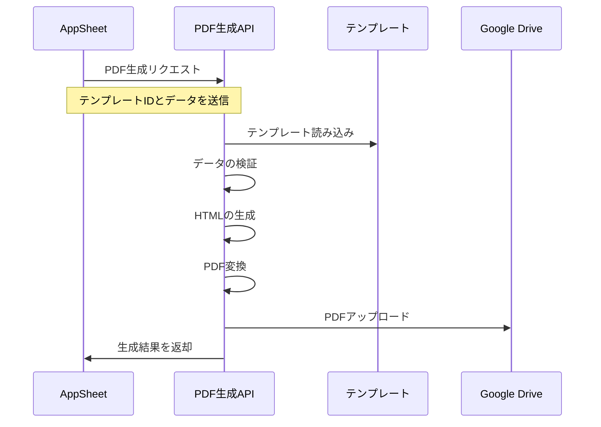
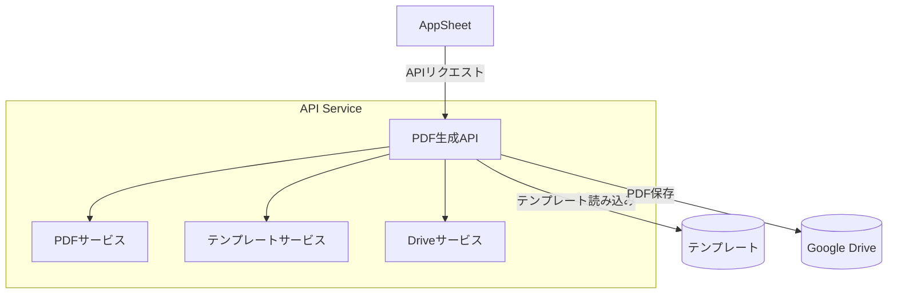
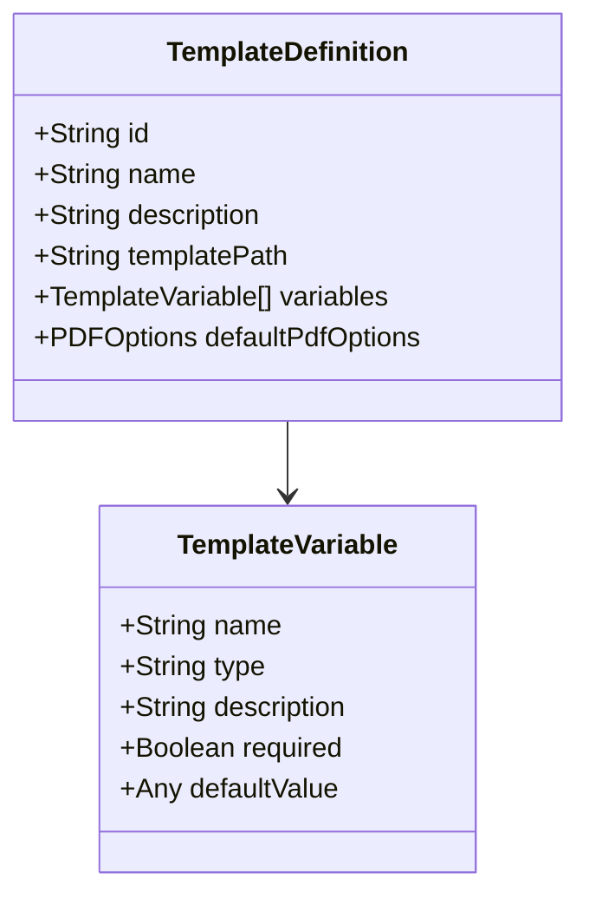
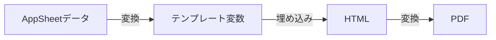
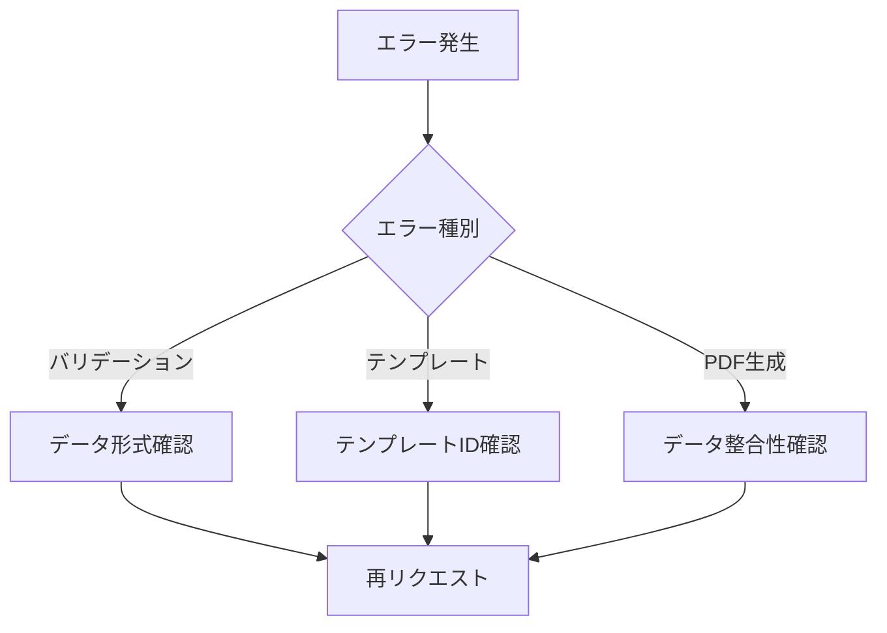

# AppSheet連携マニュアル

## 目次
1. [概要](#概要)
2. [システム構成](#システム構成)
3. [テンプレートの仕組み](#テンプレートの仕組み)
4. [APIの利用方法](#apiの利用方法)
5. [データマッピング](#データマッピング)
6. [トラブルシューティング](#トラブルシューティング)

## 概要

このドキュメントでは、AppSheetからPDF生成APIを利用する方法について説明します。
PDFの生成は、HTMLテンプレートとAppSheetから送信されるデータを組み合わせて行われます。

### 処理の流れ



## システム構成

システムは以下のコンポーネントで構成されています：



## テンプレートの仕組み

### テンプレートの構造



### 変数の型

| 型 | 説明 | 例 |
|---|---|---|
| string | 文字列 | `"タイトル"` |
| number | 数値 | `123` |
| date | 日付 | `"2025-02-20"` |
| boolean | 真偽値 | `true` |
| array | 配列 | `["項目1", "項目2"]` |

## APIの利用方法

### エンドポイント

1. **PDF生成**
```
POST /api/pdf/generate
```

2. **プレビュー生成**
```
POST /api/pdf/preview
```

3. **テンプレート一覧取得**
```
GET /api/pdf/templates
```

### リクエスト例

```json
{
  "templateId": "report",
  "data": {
    "title": "月次レポート",
    "date": "2025-02-20",
    "items": [
      ["項目A", "100", "達成"],
      ["項目B", "200", "未達成"]
    ]
  },
  "filename": "report.pdf",
  "description": "月次レポート"
}
```

### レスポンス例

```json
{
  "fileId": "1234567890",
  "webViewLink": "https://drive.google.com/file/d/...",
  "filename": "report.pdf"
}
```

## データマッピング

### 基本的なマッピング



### マッピング例

AppSheetのデータ:
```javascript
{
  "sales": {
    "month": "2月",
    "amount": 1000000,
    "items": [
      { "name": "商品A", "count": 10 },
      { "name": "商品B", "count": 20 }
    ]
  }
}
```

テンプレート定義:
```typescript
{
  "variables": [
    {
      "name": "month",
      "type": "string",
      "required": true
    },
    {
      "name": "items",
      "type": "array",
      "required": true
    }
  ]
}
```

HTMLテンプレート:
```html
<h1>{{ month }}の売上レポート</h1>
<table>
  {{#each items}}
  <tr>
    <td>{{name}}</td>
    <td>{{count}}</td>
  </tr>
  {{/each}}
</table>
```

## トラブルシューティング

### よくあるエラー

1. **VALIDATION_ERROR**
   - 原因: データの型や必須項目の不一致
   - 対処: リクエストデータの形式を確認

2. **TEMPLATE_NOT_FOUND**
   - 原因: 指定したテンプレートIDが存在しない
   - 対処: テンプレート一覧APIで利用可能なIDを確認

3. **PDF_GENERATION_ERROR**
   - 原因: PDF生成処理でのエラー
   - 対処: データ形式とテンプレートの整合性を確認

### エラー発生時のフロー


